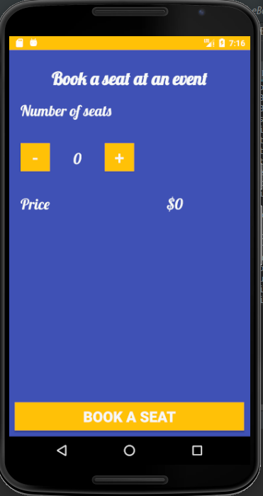

# eBooking App
#### Booking app, 13th October 2019
#### By **Cates NSENGIYUMVA**
## Description
eBooking app facilitate users to book bus tickets, hotel rooms, table reservation at a restaurant and any event, everything can be done from the comfort of your house. All you need is a you mobile devices and you can book from anywhere.
## Setup/Installation Requirements
* Go to GitHub account => www.github.com/ktscates
* Go to my repositories
* Select eBooking.
* Click on the green button labeled: clone or download. you can clone or download it directly into your computer.
* Unzip the folder.
* You should have all the project files.
## Screenshots

## Known Bugs
There no bugs in the application.
## Technologies Used
* Android studio
* Java for android
## Support and contact details
If you run into bugs, please feel free to contact me on github.
### License
Copyright (c) 2019 **Cates NSENGIYUMVA**